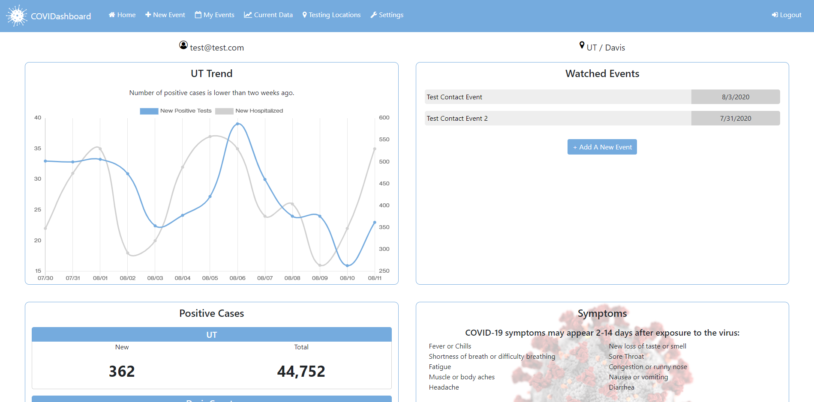
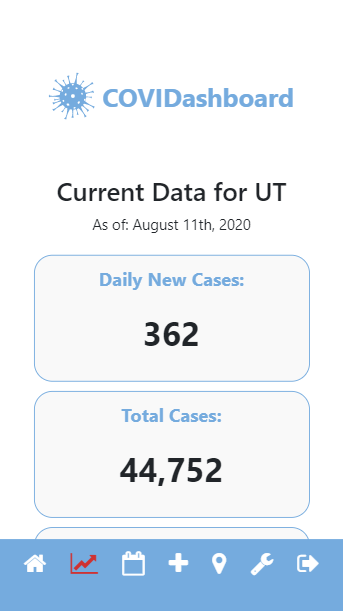

# COVIDashboard

Desktop View:\

Mobile View:\

---

### Table of Contents

- [Description](#description)
- [How to Use](#how-to-use)
- [Installation](#installation)
- [Technologies](#technologies)
- [Roadmap](#roadmap)
- [Disclaimer](#disclaimer)
- [License](#license)
- [Contributors](#contributors)

---

### Description

COVIDashboard is an individualized dashboard providing testing and patient data realated to the COVID-19 pandemic.

Features include:

1. A record keeper which allows you to keep track of any potential exposure you may have had to COVID-19.

2. Up-to-date COVID-19 data for your area.

3. Quick links to find testing locations in your area.

---

### How to Use

Sign up for an account using your email address, and supplying your current state and county (or one you're interested in monitoring). The application will utilize the location information to show relevant, personalized data across the application.

---

### Installation

COVIDashboard is deployed via Heroku and live [HERE](https://uu-covidashboard.herokuapp.com/)

---

### Technologies

MERN Stack\
-[MongoDB](https://www.mysql.com/)\
-[Express](https://expressjs.com/)\
-[React](https://reactjs.org/)\
-[Node.js](https://nodejs.org/en/)

With\
-[Bootstrap](https://getbootstrap.com/)\
-[Chart.js](https://www.chartjs.org/)\
-[Moment.js](https://momentjs.com/)\
-[Passport.js](http://www.passportjs.org/)

Data sources\
-[The COVID Tracking Project](https://covidtracking.com/data)\
-[The New York Times](https://github.com/nytimes/covid-19-data)

---

### Roadmap

Future improvements for the application:

- Add notifications to events, either push or email, that will execute after two weeks; this will alert users that they can likely delete the event if they feel there are no symptoms in that time period
- Create an interatctive trend chart that allows users to select different datapoints to chart; some examples, from the API call, include:
  - Total positive/negative tests
  - Total currently hospitalized
  - Total currently in ICU
  - Total deaths
- Expand application to other disease/virus/illnesses
  - Example: Utilize event tracking as a teacher, for tracking when a child comes to school with flu-like symptoms

---

### Disclaimer

The purpose of this application is to provide an easily-accesible, personalized snapshot of available information and resources on related to the COVID-19 pandemic.

Information collected during user creation is stored to present personalized metrics realted to COVID-19 and to ensure appropriate authorization to create, view, or delete events of potential SARS-CoV-2 exposure. Event data is not stored persistently. Once a user deletes an event all related information is deleted from the events database.

The resources and information provided is intended for educational purposes. If you suspect that you have been exposed to SARS-CoV-2 it is highly encouraged you seek medical attention.

---

### License

MIT © [shiftymitch](https://github.com/shiftymitch), [nvalline](https://github.com/nvalline), [nabeek](https://github.com/nabeek)

---

### Contributors

| Developer       | GitHub                                        |
| --------------- | --------------------------------------------- |
| Mitch Henderson | [shiftymitch](https://github.com/shiftymitch) |
| Nate Valline    | [nvalline](https://github.com/nvalline)       |
| Nick Beekhuizen | [nabeek](https://github.com/nabeek)           |

[Back to the Top](#project-name)
